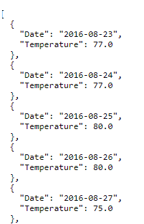

# SQLAlchemy/Flask Challenge

## Goal
For the SQLAlchemy/Flask Challenge we were tasked with conducting a climate analysis.  The data for the analysis was gathered from nine weather out post stations Honolulu Hawaii and contains data gathered from 2010 to 2017.  The components of this two-part analysis included:
* PART 1: ANALYZE AND EXPLORE THE CLIMATE DATA (SQLAlchemy)
* PART 2: DESIGN YOUR CLIMATE APP (Flask)

# Part 1: Analyze and Explore the Climate Data
Climate Data code - https://github.com/MichaelELeonard/sqlalchemy-challenge/blob/main/climate_working.ipynb

## Precipitation Analysis

For the precipitation analysis, we were tasked to examine the last 12 months of data in the hawaii.sqlite datsabase.  The last year of precipitation data was identified and extracted from the hawaii.sqlite database and read into a pandas dataframe.  A line graph outlining precipitation levels and summary statistics were used to analyze the data.

 

## Exploratory Station Analysis

In the exploratory station analysis, we analyzed the nine most active weather stations.  A histogram was then created from the final year data for the most active weather station, with temperature on the x-axis and frequency on the y-axis. 

 
 

# Part 2: Design a Climate App
Climate App code - https://github.com/MichaelELeonard/sqlalchemy-challenge/blob/main/app_working.py

For the second portion of the SQLAlchemy Challenge an interactive climate app was created using Python and Flask.  An API Index was established to display all the available API routes for the end user to utilize.

## Precipitation 
For the precipitation static API route, the measurement date and precipitation amount for the last year of data was collected for the database.  The output data included:
* Date
* Precipitation

## Stations
For the precipitation static API route all the data specific to each station was queried from the database.  The station specific data included:
* Elevation
* Latitude
* Longitude
* Name
* Station

## Temperature  
For the temperature static API route, the last year of temperature for the most active station was queried.  The output data included:
* Date
* Temperature

## Start Date / Start Date & End Date
For the Start Date and Start & End Date dynamic API routes the end user will manually enter the Start or Start and End dates to establish the date range to be examined.   These input dates will be utilized to query the database and calculate the min, max and avg temperatures of the requested range.  The output fields for the Start Date/Start & End Date dynamic API routes include:
* Average
* Minimum
* Maximum

 

### Start Date

Date manually entered 2010-09-18

### Start Date & End Date

Date manually entered 2010-09-18 to 2010-09-24

